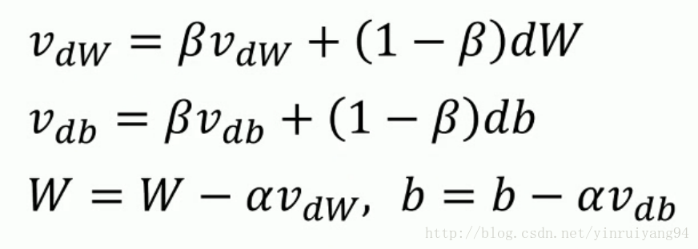

这个就是动量梯度下降的参数更新公式。
我们可以看出，在这个公式中，并不是直接减去αdW和αdb，而是计算出了一个vdW和vdb。这又是什么呢？
## momentum
在此需要引入一个叫做指数加权平均的知识点。也就是上图中的前两行公式。使用这个公式，可以将之前的dW和db都联系起来，不再是每一次梯度都是独立的情况。其中β是可以自行设置的超参数，一般情况下默认为0.9（也可以设置为其他数值）。β代表了现在的vdW和vdb与之前的1 / (1 - β)个vdW和vdb有关。0.9就是现在的vdW和vdb是平均了之前10天的vdW和vdb的结果。
此时的梯度不再只是我现在的数据的梯度，而是有一定权重的之前的梯度，就我个人认为，就像是把原本的梯度压缩一点，并且补上一个之前就已经存在的“动量”。
举个例子，如果你站在一个地方不动，让你立刻向后转齐步走，你可以迅速向后转然后就向相反的方向走了起来，批梯度下降和随机梯度下降就是这样，某一时刻的梯度只与这一时刻有关，改变方向可以做到立刻就变。而如果你正在按照某个速度向前跑，再让你立刻向后转，可以想象得到吧，此时你无法立刻将速度降为0然后改变方向，你由于之前的速度的作用，有可能会慢慢减速然后转一个弯。
动量梯度下降是同理的，每一次梯度下降都会有一个之前的速度的作用，如果我这次的方向与之前相同，则会因为之前的速度继续加速；如果这次的方向与之前相反，则会由于之前存在速度的作用不会产生一个急转弯，而是尽量把路线向一条直线拉过去。
这就解决了文中第一个图的那个在普通梯度下降中存在的下降路线折来折去浪费时间的问题。
与Momentum的机制类似的，还有一种叫做RMSprop的算法，他们俩的效果也是类似，都解决了相同的问题，使梯度下降时的折返情况减轻，从而加快训练速度。因为下降的路线更接近同一个方向，因此也可以将学习率增大来加快训练速度。
Momentum和RMSprop的结合，产生了一种权威算法叫做Adam，Adam结合了前两者的计算方式形成自己的优化方法，基本适用于所有的模型和网络结构。
## 1 torch.optim.SGD
class torch.optim.SGD(params, lr=, momentum=0, dampening=0, weight_decay=0, nesterov=False)
功能：
可实现SGD优化算法，带动量SGD优化算法，带NAG(Nesterov accelerated gradient)动量SGD优化算法,并且均可拥有weight_decay项。
参数：
params(iterable)- 参数组(参数组的概念请查看 3.2 优化器基类：Optimizer)，优化器要管理的那部分参数。
lr(float)- 初始学习率，可按需随着训练过程不断调整学习率。
momentum(float)- 动量，通常设置为0.9，0.8
dampening(float)- dampening for momentum ，暂时不了其功能，在源码中是这样用的：buf.mul_(momentum).add_(1 - dampening, d_p)，值得注意的是，若采用nesterov，dampening必须为 0.
weight_decay(float)- 权值衰减系数，也就是L2正则项的系数
nesterov(bool)- bool选项，是否使用NAG(Nesterov accelerated gradient)

注意事项：
pytroch中使用SGD十分需要注意的是，更新公式与其他框架略有不同！
pytorch中是这样的：
`v=ρ∗v+g`
`p=p−lr∗v = p - lr∗ρ∗v - lr∗g`
其他框架：
v=ρ∗v+lr∗g
p=p−v = p - ρ∗v - lr∗g
ρ是动量，v是速率，g是梯度，p是参数，其实差别就是在ρ∗v这一项，pytorch中将此项也乘了一个学习率。

## 2 torch.optim.ASGD
class torch.optim.ASGD(params, lr=0.01, lambd=0.0001, alpha=0.75, t0=1000000.0, weight_decay=0)
功能：
ASGD也成为SAG，均表示随机平均梯度下降(Averaged Stochastic Gradient Descent)，简单地说ASGD就是用空间换时间的一种SGD，详细可参看论文：http://riejohnson.com/rie/stograd_nips.pdf
参数:
params(iterable)- 参数组(参数组的概念请查看 3.1 优化器基类：Optimizer)，优化器要优化的那些参数。
lr(float)- 初始学习率，可按需随着训练过程不断调整学习率。
lambd(float)- 衰减项，默认值1e-4。
alpha(float)- power for eta update ，默认值0.75。
t0(float)- point at which to start averaging，默认值1e6。
weight_decay(float)- 权值衰减系数，也就是L2正则项的系数。

## 3 torch.optim.Rprop
class torch.optim.Rprop(params, lr=0.01, etas=(0.5, 1.2), step_sizes=(1e-06, 50))
功能：
实现Rprop优化方法(弹性反向传播)，优化方法原文《Martin Riedmiller und Heinrich Braun: Rprop - A Fast Adaptive Learning Algorithm. Proceedings of the International Symposium on Computer and Information Science VII, 1992》
该优化方法适用于full-batch，不适用于mini-batch，因而在min-batch大行其道的时代里，很少见到。

## 4 torch.optim.Adagrad
class torch.optim.Adagrad(params, lr=0.01, lr_decay=0, weight_decay=0, initial_accumulator_value=0)
功能：
实现Adagrad优化方法(Adaptive Gradient)，Adagrad是一种自适应优化方法，是自适应的为各个参数分配不同的学习率。这个学习率的变化，会受到梯度的大小和迭代次数的影响。梯度越大，学习率越小；梯度越小，学习率越大。缺点是训练后期，学习率过小，因为Adagrad累加之前所有的梯度平方作为分母。
详细公式请阅读：Adaptive Subgradient Methods for Online Learning and Stochastic Optimization
John Duchi, Elad Hazan, Yoram Singer; 12(Jul):2121−2159, 2011.(http://www.jmlr.org/papers/volume12/duchi11a/duchi11a.pdf)

## 5 torch.optim.Adadelta
class torch.optim.Adadelta(params, lr=1.0, rho=0.9, eps=1e-06, weight_decay=0)
功能：
实现Adadelta优化方法。Adadelta是Adagrad的改进。Adadelta分母中采用距离当前时间点比较近的累计项，这可以避免在训练后期，学习率过小。
详细公式请阅读:https://arxiv.org/pdf/1212.5701.pdf

6 torch.optim.RMSprop
class torch.optim.RMSprop(params, lr=0.01, alpha=0.99, eps=1e-08, weight_decay=0, momentum=0, centered=False)
功能：
实现RMSprop优化方法（Hinton提出），RMS是均方根（root meam square）的意思。RMSprop和Adadelta一样，也是对Adagrad的一种改进。RMSprop采用均方根作为分母，可缓解Adagrad学习率下降较快的问题。并且引入均方根，可以减少摆动，详细了解可读：http://www.cs.toronto.edu/~tijmen/csc321/slides/lecture_slides_lec6.pdf

## 7 torch.optim.Adam(AMSGrad)
class torch.optim.Adam(params, lr=0.001, betas=(0.9, 0.999), eps=1e-08, weight_decay=0, amsgrad=False)
功能：
实现Adam(Adaptive Moment Estimation))优化方法。Adam是一种自适应学习率的优化方法，Adam利用梯度的一阶矩估计和二阶矩估计动态的调整学习率。吴老师课上说过，Adam是结合了Momentum和RMSprop，并进行了偏差修正。
参数：
amsgrad- 是否采用AMSGrad优化方法，asmgrad优化方法是针对Adam的改进，通过添加额外的约束，使学习率始终为正值。(AMSGrad，ICLR-2018 Best-Pper之一，《On the convergence of Adam and Beyond》)。
详细了解Adam可阅读,Adam: A Method for Stochastic Optimization(https://arxiv.org/abs/1412.6980)。

## 8 torch.optim.Adamax
class torch.optim.Adamax(params, lr=0.002, betas=(0.9, 0.999), eps=1e-08, weight_decay=0)
功能：
实现Adamax优化方法。Adamax是对Adam增加了一个学习率上限的概念，所以也称之为Adamax。
详细了解可阅读，Adam: A Method for Stochastic Optimization(https://arxiv.org/abs/1412.6980)(没错，就是Adam论文中提出了Adamax)。

## 9 torch.optim.SparseAdam
class torch.optim.SparseAdam(params, lr=0.001, betas=(0.9, 0.999), eps=1e-08)
功能：
针对稀疏张量的一种“阉割版”Adam优化方法。
only moments that show up in the gradient get updated, and only those portions of the gradient get applied to the parameters

## 10 torch.optim.LBFGS
class torch.optim.LBFGS(params, lr=1, max_iter=20, max_eval=None, tolerance_grad=1e-05, tolerance_change=1e-09, history_size=100, line_search_fn=None)
功能：
实现L-BFGS（Limited-memory Broyden–Fletcher–Goldfarb–Shanno）优化方法。L-BFGS属于拟牛顿算法。L-BFGS是对BFGS的改进，特点就是节省内存。
使用注意事项：
1.This optimizer doesn’t support per-parameter options and parameter groups (there can be only one).
Right now all parameters have to be on a single device. This will be improved in the future.(2018-10-07)