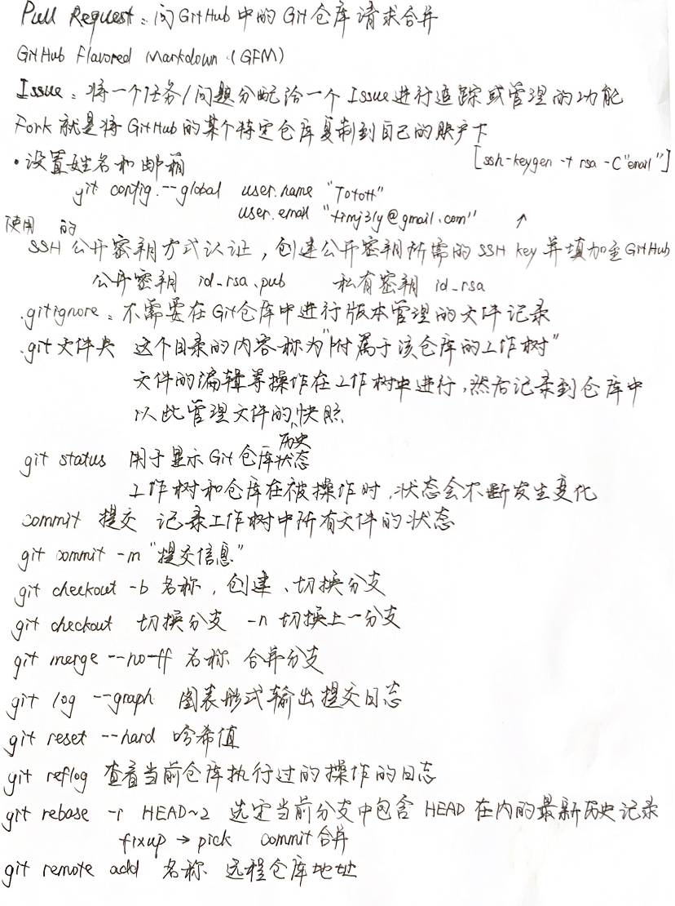

## Git push
### 推送至master 分支
如果想将当前分支下本地仓库中的内容推送给远程仓库，需要用到`git push`命令。现在假定我们在master 分支下进行操作。
```
$ git push -u origin master
Counting objects: 20, done.
Delta compression using up to 8 threads.
Compressing objects: 100% (10/10), done.
Writing objects: 100% (20/20), 1.60 KiB, done.
Total 20 (delta 3), reused 0 (delta 0)
To git@github.com:github-book/git-tutorial.git
* [new branch] master -> master
Branch master set up to track remote branch master from origin.
```
像这样执行git push命令，当前分支的内容就会被推送给远程仓库 origin 的master 分支。
`-u`参数可以在推送的同时，将 origin 仓库的master 分支设置为本地仓库当前分支的`upstream`（上游）。添加了这个参数，将来运行git pull命令从远程仓库获取内容时，本地仓库的这个分支就可以直接从 origin 的 master 分支获取内容，省去了另外添加参数的麻烦。
执行该操作后，当前本地仓库master 分支的内容将会被推送到 GitHub 的远程仓库中。在 GitHub 上也可以确认远程 master 分支的内容和本地 master 分支相同。

### 推送至master 以外的分支
除了master 分支之外，远程仓库也可以创建其他分支。举个例子，我
们在本地仓库中创建feature-D 分支，并将它以同名形式push 至远程仓库。
```
$ git checkout -b feature-D
Switched to a new branch 'feature-D'
```
我们在本地仓库中创建了feature-D 分支，现在将它push 给远程仓
库并保持分支名称不变。

```
$ git push -u origin feature-D
Total 0 (delta 0), reused 0 (delta 0)
To git@github.com:github-book/git-tutorial.git
* [new branch] feature-D -> feature-D
Branch feature-D set up to track remote branch feature-D from origin.
```
现在，在远程仓库的GitHub 页面就可以查看到feature-D 分支了。


## 其他常用命令
